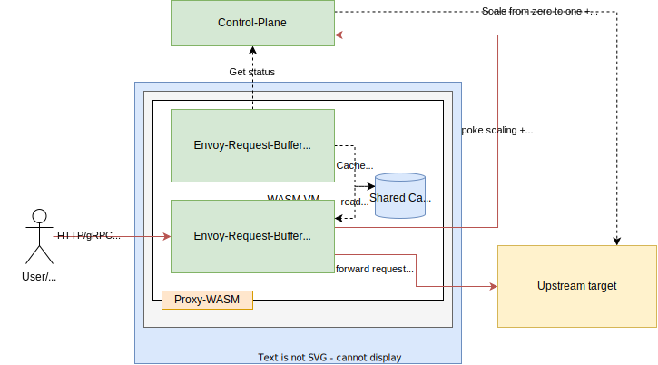

# PoC: Envoy based request buffering with WASM

This repo contains a simple PoC for request buffering in Envoy using Proxy-WASM.
Note: The control-plane does not really check if the backend is scaled, nor is the control-plane called to actually scale the upstream target. 

## Local setup

```bash
brew tap tinygo-org/tools
brew install tinygo
```

## Architecture



**References**

* [Proxy-WASM spec](https://github.com/proxy-wasm/spec/blob/master/docs/WebAssembly-in-Envoy.md)
* [Proxy-WASM golang SDK docs](https://github.com/tetratelabs/proxy-wasm-go-sdk/blob/main/doc/OVERVIEW.md)

**Ports**

* 7001: [control plane](./control-plane/main.go)
* 8001: Envoy admin endpoint
* 9000: Envoy traffic endpoint (hosts: `http.example.com`, `grpc.example.com`)
* 50001: [upstream backend (http)](./upstream/main.go)
* 50002: [upstream backend (grpc)](./upstream/main.go)

## Demo


## Building + running

```bash
make build && docker-compose up
```

## Setting hosts to scaled to zero

The control-plane returns a list of which services are "scaled-to-zero" (dummy):

```bash
# Get current list
curl localhost:7001/ 
[]
```

```bash
# Setting a service to "scaled to zero" or unset "scaled to zero"
curl -X POST "localhost:7001/set-scaled-to-zero?host=http.example.com"
curl -X POST "localhost:7001/set-scaled-to-zero?host=grpc.example.com"
```

## Testing directly

```bash
# HTTP
curl localhost:50001
Hello from HTTP Server
```

```bash
# GRPC
grpcurl -plaintext localhost:50002 grpc.health.v1.Health/Check
{
  "status": "SERVING"
}
```

## Testing via Envoy

```bash
# HTTP
curl localhost:9000 -H 'Host: http.example.com'
Hello from HTTP Server
```

```bash
# GRPC
grpcurl -plaintext -authority grpc.example.com localhost:9000 grpc.health.v1.Health/Check
{
  "status": "SERVING"
}
```

## Things to look at next
 
- [ ] Testing performance and overhead
- [ ] Testing behaviour, CPU+memory consumption with a lot of hold requests
- [ ] Test data architecture (how many request context can be held, how does envoy scale the HTTP contexts)?
- [ ] Make it work with Envoy Gateway-API integration
- [ ] Make it work on K8s, get the scaled-to-zero status from K8s
- [ ] Poke the control-plane to actually scale on requests when scaled to zero
