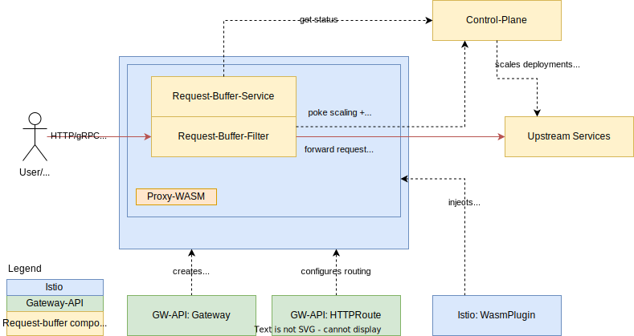

# PoC: Envoy based request buffering with WASM

This repo contains a simple PoC for request buffering in Envoy using Proxy-WASM.
Note: The control-plane does not really check if the backend is scaled, nor is the control-plane called to actually scale the upstream target. 

## Architecture

### In Envoy

See [envoy](./ENVOY.md#architecture)

### In Kubernetes

In the Kubernetes example, this PoC is using [istio with Wasm Plugin](https://istio.io/latest/docs/reference/config/proxy_extensions/wasm-plugin/). 
The networking is configured using [gateway-api](https://gateway-api.sigs.k8s.io/) resources, while the WASM plugin in Envoy takes care of buffering requests if necessary.

**References**

* [Proxy-WASM spec](https://github.com/proxy-wasm/spec/blob/master/docs/WebAssembly-in-Envoy.md)
* [Proxy-WASM golang SDK docs](https://github.com/tetratelabs/proxy-wasm-go-sdk/blob/main/doc/OVERVIEW.md)

## Variants

* [In Kubernetes](./KUBERNETES.md)
* [Local envoy in docker-compose](./ENVOY.md)

## Kubernetes Demo

For more info about the demo see the scripts in [demo](./kubernetes/demo)

## Things to look at next
 
- [ ] Testing performance and overhead
- [ ] Testing behaviour, CPU+memory consumption with a lot of hold requests
- [ ] Test data architecture (how many request context can be held, how does envoy scale the HTTP contexts)?
- [ ] Make it work with Envoy Gateway-API integration
- [x] Make it work on K8s, get the scaled-to-zero status from K8s
- [x] Poke the control-plane to actually scale on requests when scaled to zero

## Learnings

* For now the proxy-wasm-go-sdk uses `tinygo`, which has some downsides
  * Not all standard library packages are supported
  * No serialization packages work
  * Limited working dependencies available
  * No gRPC support for now --> https://github.com/tetratelabs/proxy-wasm-go-sdk/issues/14
* The API of the SDK is a bit peculiar
* Error reporting is quite limited (e.g. when a httpContextID is no longer available, a generic `bad argument` error is returned)
* Another option might be to consider using Rust for the module, [as Kuadrant dit](https://github.com/Kuadrant/wasm-shim) 
* Istio does not yet support `kind: WASMModule` for singletons (WASMServices) --> https://github.com/istio/istio/issues/49451
